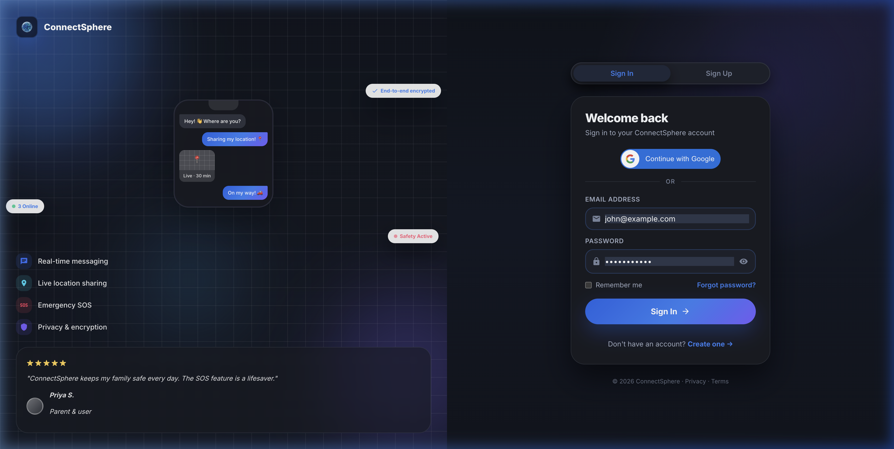
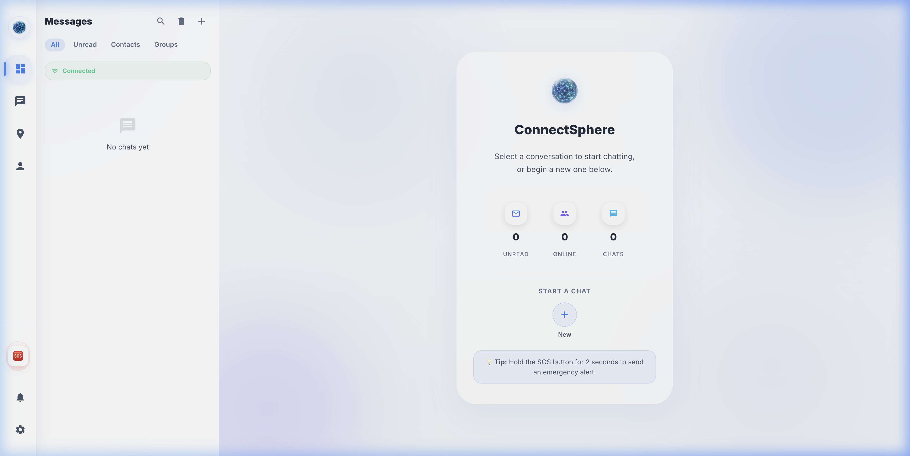
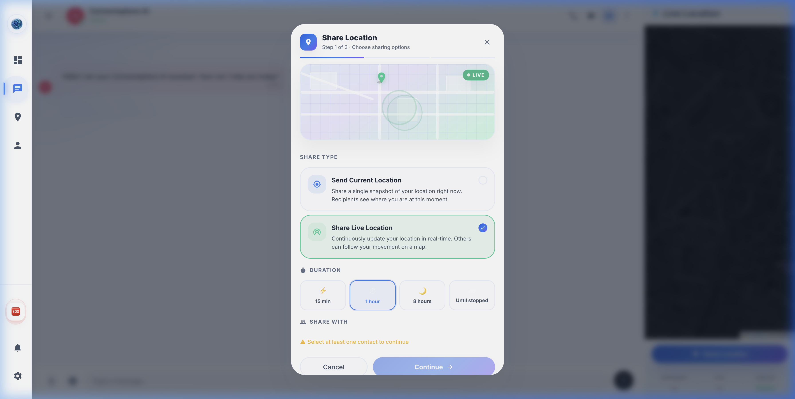
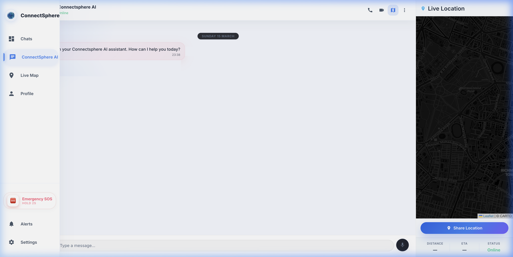
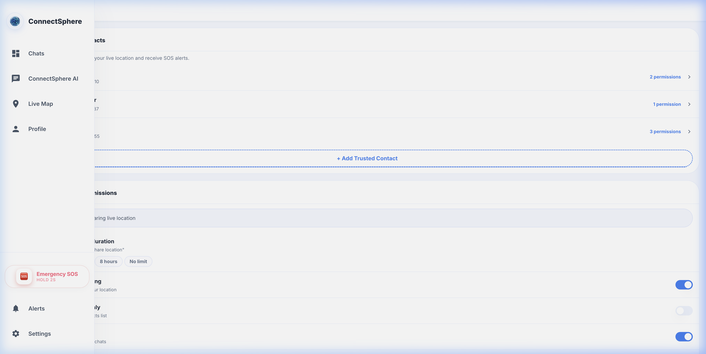
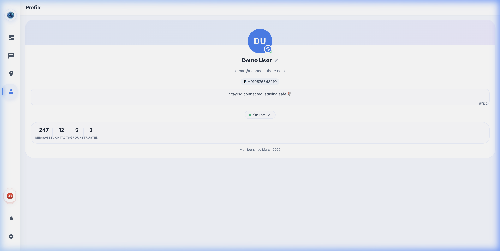
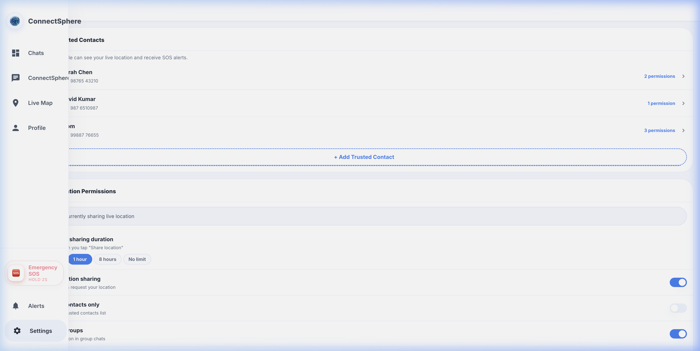

# ConnectSphere — Application Screens

> A comprehensive overview of the 7 key screens in the ConnectSphere application.

---

## 1. 🔐 Login Screen

Sign in with email/password or Google OAuth. Features end-to-end encryption badge, live location sharing preview, and user testimonials.

---

## 2. 💬 Chat List

The main dashboard showing all conversations with filters (All, Unread, Contacts, Groups), quick stats (Unread / Online / Chats), and the "Start a Chat" action.

---

## 3. 📍 Location Sharing Option

The **Share Location** modal (Step 1 of 3) lets users choose between:
- **Send Current Location** — a single snapshot of your position
- **Share Live Location** — continuous real-time updates on a map

---

## 4. ⏱️ Duration Selection

Within the Share Location modal, users select how long to share live location:

| Option | Icon | Description |
|--------|------|-------------|
| 15 min | ⚡ | Quick share |
| 1 hour | 🕐 | Default |
| 8 hours | 🌙 | Extended |
| Until stopped | ∞ | Manual stop |

> *Duration selector is visible in the bottom half of the Location Sharing screenshot above.*

---

## 5. 🗺️ Live Location Tracking

The chat view with an integrated **Live Location** map panel on the right side. The dark-themed Leaflet map displays the user's position with:
- **Share Location** action button
- **Distance** & **ETA** indicators
- **Online status** of the contact

---

## 6. 🆘 Emergency SOS

The **Emergency SOS** button is always visible in the sidebar. Hold for **2 seconds** to trigger an emergency alert to all trusted contacts with your current location.

---

## 7. 👤 Profile & Privacy

### Profile
User avatar with initials, bio, online status, and stats (Messages, Contacts, Groups, Trusted).

### Privacy & Settings
Trusted Contacts management, Location Permissions, default sharing duration, and privacy toggles (Location sharing, Trusted contacts only, Groups).

---

> **ConnectSphere** — *Staying connected, staying safe* 🛡️
